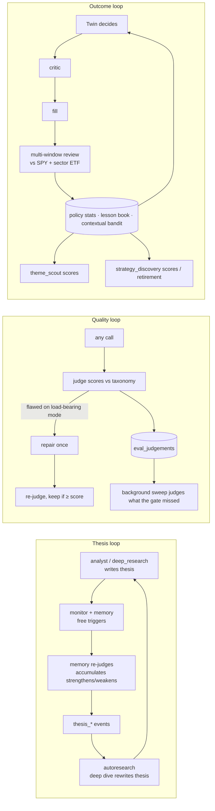

# 01 — The Original: System Overview

## What it is

A personal, single-user "autonomous stock-research engine." From its README:

> Robinhood opened their platform to AI agents (May 2026) but ships **no intelligence** — they're the rails, you bring the brain. This is the brain. It reads your **real** portfolio (read-only), researches the market, learns your risk personality, and hands you fully-reasoned trade tickets. **You execute the trades yourself** — the brain never places an order.

Its own product vision doc calls the north star a "source-aware investing operating system" and insists on staying a **research copilot** until an evaluation layer can answer *"Is the brain actually good?"* — execution is framed as "an identity shift that requires measured trust first."

The name drifted during development: the README says **Brain**, the FastAPI app is titled **"Signal Research Engine"**, the UI brands itself **Signal**. This doc uses "Signal" for the product and the code names for modules.

## Repository shape

```
robinhood-agentic-main/            89 files, ~20.5k lines, no git history
├── cli.py                         argparse front-end (partly broken)
├── brain/                         the whole intelligence layer
│   ├── config.py                  ~45 env vars
│   ├── models.py                  Pydantic domain models = LLM output schemas
│   ├── llm.py                     Anthropic wrapper (frozen cached system prompt)
│   ├── agent.py                   the chat agent loop (16 tools + web search)
│   ├── orchestrator.py            public API the web/CLI call (839 lines)
│   ├── mandate.py                 the user's standing goal
│   ├── shadow.py                  paper-trade ledger with benchmark anchors
│   ├── research_state.py          watchlist + theses + briefings (JSON + DB)
│   ├── evals.py                   12-mode failure taxonomy
│   ├── profile_store.py / profile_learning.py
│   ├── engines/                   16 engines (monitor … twin, 1,309 lines)
│   ├── data/                      prices, news, catalysts, sentiment, edgar,
│   │                              robinhood_charts, universe(+sp500.json), market_clock
│   ├── db/                        SQLAlchemy models (24 tables), session, repository (2,127 lines)
│   └── portfolio/                 manual JSON source | robin_stocks read-only source
├── web/app.py                     FastAPI, 37 routes, 3 background loops (797 lines)
├── web/static/                    index.html + app.js (2,513 lines) + style.css (1,061 lines)
├── tests/                         23 unittest files, 2,876 lines
├── scripts/reset_state.py         wipe-to-first-run
└── design/                        product roadmap, UI vision, logo concepts (md + svg)
```

Dependencies (`requirements.txt`): `anthropic>=0.92`, `fastapi`, `uvicorn[standard]`, `yfinance`, `feedparser`, `robin_stocks>=3.1`, `pydantic>=2.8`, `python-dotenv`, `httpx`, `sqlalchemy>=2.0`, `alembic>=1.13` (declared, **zero migrations exist**), `psycopg[binary]`. Undeclared but used: `requests` (edgar.py), `pyotp` (optional TOTP).

## Architecture

```mermaid
flowchart TD
    UI[Web dashboard<br/>index.html + app.js] -->|REST + SSE| API[web/app.py<br/>FastAPI · 37 routes]
    CLI[cli.py] --> ORCH
    API --> ORCH[brain/orchestrator.py<br/>public API · caches · gates]
    API -. 3 asyncio loops .-> LOOPS[fast 120s · slow 180s · briefing]
    LOOPS --> ORCH
    ORCH --> AGENT[agent.py<br/>chat tool loop]
    ORCH --> ENG[engines/<br/>monitor · memory · findings · structural_risk · discovery<br/>analyst · judge · researcher · deep_research · autoresearch<br/>missions · theme_scout · strategy_discovery · evaluation · briefing · twin]
    AGENT --> LLM[llm.py<br/>Anthropic · cached system prompt<br/>parse() · web_research()]
    ENG --> LLM
    ENG --> DATA[data/<br/>yfinance · RSS · Finnhub · StockTwits/ApeWisdom · EDGAR · RH charts · universe · market clock]
    ENG --> DB[(db/<br/>SQLite or Postgres · 24 tables)]
    ORCH --> PF[portfolio/<br/>manual JSON | robin_stocks read-only]
    PF --> DB
    ENG --> SHADOW[shadow.py<br/>paper ledger + SPY/sector anchors]
    SHADOW --> DB
```

Design stance, stated repeatedly in code: **the LLM never predicts prices or recalls numbers — it only interprets grounded data the code fetched**, and **the model does judgement while the code does arithmetic**.

## The three background loops (`web/app.py`)

There is no single "agent loop." There are three, started in `@app.on_event("startup")`, all process-local (running `uvicorn --workers N` would spawn N independent brains).

| Loop | Period | What it does | Spends tokens? |
|---|---|---|---|
| `_refresh_loop` (FAST) | `AUTO_REFRESH_SECONDS` = 120 | `refresh_live_state()` (clear caches, re-read portfolio), `scoreboard(True)` (mark paper trades to market), `run_monitors()` (deterministic event detection, in its own try so a detector failure can't mark prices stale) | No |
| `_brain_loop` (SLOW) | `BRAIN_LOOP_SECONDS` = 180 (a ceiling, not the cadence) | Walks the 16-step `_BRAIN_STEPS` pipeline sequentially; each step in `asyncio.to_thread` with a per-step `wait_for` deadline; every step self-gates internally | Yes, gated |
| `_briefing_loop` | ticks every 60 s | Fires a morning briefing at/after `06:30` and evening at `16:30` local time, once per day, via string comparison of `HH:MM` | Yes, 2/day |

The loop split is the original's most-cited bug fix: *"a multi-minute deep dive here never freezes prices or trips the 'updater looks down' banner — that was the bug."* A staleness heartbeat (`_REFRESH.last_ok`) drives a visible "background updater looks down" banner.

Caveat: `asyncio.wait_for` + `to_thread` **cannot kill the thread** on timeout; a stalled LLM/network call keeps running in the executor, so repeated timeouts can exhaust the pool.

## The 16-step brain pipeline (`_BRAIN_STEPS`)

Lifted to module scope "so the timeline UI can show all steps… even before they have run this cycle."

| # | key | Orchestrator fn | Timeout | Self-gate (why a calm book spends nothing) |
|---|---|---|---|---|
| 1 | `sentiment` | `ingest_sentiment` | 60 s | `SENTIMENT_TTL_SECONDS` (1800) + 12 h/ticker `social_buzz` cooldown |
| 2 | `catalysts` | `ingest_catalysts` | 60 s | `FINNHUB_TTL_SECONDS` (900) + 6 h/name cooldown; no-op without a key |
| 3 | `memory` | `revisit_memory` | 420 s | Only held theses that trip a free trigger; once/day/name |
| 4 | `missions` | `run_due_missions` | 300 s | Classify ≥20 h, reseed ≥168 h |
| 5 | `autoresearch` | `run_autoresearch` | 900 s | Only thesis_broken/thesis_review/mission-BUY events; 72 h/name; 1 dive/cycle |
| 6 | `structural_risk` | `run_structural_risk` | 300 s | Weight-signature cache, 6 h TTL |
| 7 | `mandate_review` | `run_mandate_review` | 300 s | At most once per `MANDATE_REVIEW_DAYS` (7) |
| 8 | `mandate_drift` | `run_mandate_drift` | 300 s | Weight move ≥ `MANDATE_DRIFT_PCT` (12 pts) or new/exited position; 24 h cooldown |
| 9 | `theme_scout` | `run_theme_scout` | 240 s | `THEME_SCOUT_HOURS` (6); no LLM |
| 10 | `strategy_discovery` | `run_strategy_discovery` | 240 s | `STRATEGY_DISCOVERY_HOURS` (6); no LLM |
| 11 | `twin_review` | `twin_review_windows` | 180 s | Only review windows whose due date passed |
| 12 | `twin_decision` | `run_twin_decision` | 420 s | `TWIN_DECIDE_HOURS` (4) since last decision; skipped if orders pending |
| 13 | `twin_fill` | `twin_execute_pending` | 180 s | Only when market is open |
| 14 | `twin_snapshot` | `twin_snapshot` | 180 s | Only if Twin running |
| 15 | `judge` | `judge_recent_traces` | 360 s | `JUDGE_SWEEP_MAX` (4) unscored traces per cycle |
| 16 | `feed` | `prewarm_feed` | 240 s | Holdings+latest-event signature cache, 3 h TTL |

Worst case if every step times out: ~82 minutes per cycle. There is no total-cycle deadline.

## The gate discipline (the pattern that makes this affordable)

Every expensive path is guarded by up to three independent mechanisms:

1. **In-process TTL cache** (e.g. `_FEED_CACHE`, `_RISK_CACHE`, `_MANDATE_REVIEW`) — module-level dicts, not thread-safe.
2. **Content signature** — e.g. the feed only re-curates when `(sorted holdings×rounded value, latest event id)` changes; structural risk when `(ticker, rounded weight%)` changes.
3. **DB cooldown event** — `db_repo.event_exists_recent(event_type, ticker, within_hours)` is the universal primitive; the event that *displays* a result (e.g. `deep_dive`) doubles as its own rate-limit marker and survives restarts.

## Events as the universal bus

`research_events` rows (`event_type, ticker, severity, title, summary, source, created_at`) are simultaneously:

- the **Activity** UI feed and the **Home** stream (filtered by severity),
- **cooldown markers** for every engine,
- **triggers** for other engines (`thesis_broken` → autoresearch; `mission_update`/warn → autoresearch; all events → theme_scout's `_event_hits`; `thesis_broken` → Twin preflight cancels buys),
- **candidate-universe input** for the Twin (recent events on non-held names),
- **backbone** of the LLM-curated findings feed ("treat them as ground truth").

## The three learning loops (and which ones close)



**The asymmetry:** the Twin learns from its realized results; the advisory engines (analyst, discovery) do not — `shadow.py` + `evaluation.py` grade them, but nothing feeds the scorecard back into their prompts. Fixing this is a headline improvement in `13-research-and-evaluation-engine.md`.

## The LLM layer in one table

| Property | Value |
|---|---|
| Provider | Anthropic SDK (only) |
| Model | `BRAIN_MODEL` = `claude-opus-4-7` |
| Effort | `BRAIN_EFFORT` = `high`; judge at `medium`; Twin thesis review at `low` |
| Thinking | `{"type": "adaptive"}` on every call |
| System prompt | One frozen block with `cache_control: ephemeral`; byte-stable (no timestamps) |
| Date anchoring | `today_line()` injected into the *user* message so the cache survives |
| Structured output | `messages.parse(output_format=PydanticModel)` |
| Web search | Server-side `web_search_20260209`, max 6 uses, blocklist `zacks.com, fool.com, investorplace.com, stocktwits.com` |
| Two-step pattern | `web_research()` (cited prose) → `parse()` (schema) because search can't share a request with structured output |
| Client | `timeout=120s`, `max_retries=1` (a stalled search once froze the brain loop for 20+ min) |
| Cost accounting | **None** — no token counting, no spend ledger anywhere |

## Configuration (all env-driven, `brain/config.py`)

| Group | Vars (default) |
|---|---|
| LLM | `ANTHROPIC_API_KEY`, `BRAIN_MODEL` (claude-opus-4-7), `BRAIN_EFFORT` (high) |
| Portfolio/DB | `PORTFOLIO_SOURCE` (manual\|robinhood), `DATABASE_URL` (sqlite:///data_store/brain.db), `RH_USERNAME`, `RH_PASSWORD`, `RH_MFA` (TOTP secret) |
| Cache TTLs | `PORTFOLIO_TTL_SECONDS` 30, `QUOTE_TTL_SECONDS` 60, `SIGNAL_TTL_SECONDS` 900, `SCREEN_TTL_SECONDS` 1800, `NEWS_TTL_SECONDS` 900 |
| Loops | `AUTO_REFRESH_SECONDS` 120 (≤0 disables **both** loops), `BRAIN_LOOP_SECONDS` 180, `AUTO_BRIEFINGS` true, `MORNING_BRIEF_TIME` 06:30, `EVENING_BRIEF_TIME` 16:30 |
| Mandate | `MANDATE_REVIEW_DAYS` 7, `MANDATE_DRIFT_PCT` 12, `MANDATE_DRIFT_COOLDOWN_HOURS` 24 |
| Twin | `TWIN_ENABLED` true, `TWIN_DECIDE_HOURS` 4, `THEME_SCOUT_HOURS` 6, `STRATEGY_DISCOVERY_HOURS` 6, `TWIN_PREFLIGHT_BUY_MAX_UP_PCT` 4, `TWIN_PREFLIGHT_SELL_MAX_DOWN_PCT` 8 |
| Research | `AUTO_DEEP_RESEARCH` true |
| Judge | `JUDGE_ENABLED` true, `SELF_CRITIQUE` true, `JUDGE_EFFORT` medium, `JUDGE_SWEEP_MAX` 4 |
| Sentiment | `SENTIMENT_ENABLED` true, `SENTIMENT_TTL_SECONDS` 1800, `SENTIMENT_BUZZ_PCT` 50, `SENTIMENT_BUZZ_MIN` 25 |
| Catalysts | `FINNHUB_API_KEY`, `FINNHUB_ENABLED` true, `FINNHUB_TTL_SECONDS` 900, `FINNHUB_FRESH_HOURS` 6, `FINNHUB_COOLDOWN_HOURS` 6 |
| EDGAR | `EDGAR_USER_AGENT` (read directly in edgar.py) |

Persistence paths under `data_store/` (gitignored): `profile.json`, `shadow_ledger.jsonl` (legacy, migrated once), `holdings_manual.json`, `research_state.json`, `portfolio_snapshot.json`, `digests/`, `brain.db`.

## How to run the original

```bash
python -m venv .venv && source .venv/bin/activate
pip install -r requirements.txt
cp .env.example .env     # NOTE: .env.example is gitignored and does not exist — create .env by hand
uvicorn web.app:app --reload   # http://127.0.0.1:8000
python cli.py analyze NVDA | discover --flavor stable | ask "..." | score | portfolio | memory
# broken: python cli.py digest (calls a nonexistent brain.daily_digest), db-stats (references removed models)
.venv/bin/python -m unittest discover -s tests
python -m scripts.reset_state --yes   # wipe to first run (dry-run without --yes)
```

## What the original never did

- Place an order (by design), or model slippage/spread/commissions in paper fills.
- Authenticate anyone (every route is open; several spend LLM tokens or destroy state).
- Migrate a schema (29 hand-written `ALTER TABLE` statements, Postgres-only).
- Log a DB failure (~60 `except Exception: return <empty>` with no logging).
- Count a token or a dollar of LLM spend.
- Test the web layer or the frontend (0%).
- Discover a theme it wasn't hardcoded with (8 fixed themes, 3 fixed tactics).
- Feed scorecard outcomes back into the advisory engines' prompts.
