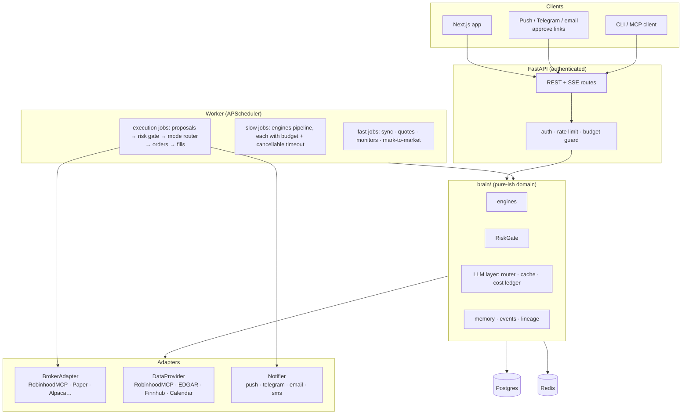
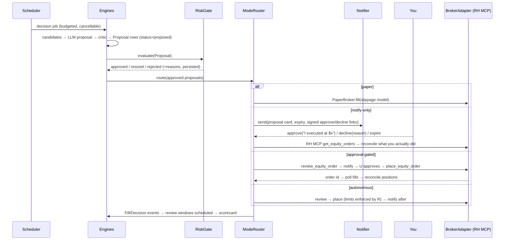

# 11 — Architecture Blueprint

## Stack

| Layer | Choice | Why |
|---|---|---|
| Backend | **Python 3.12, FastAPI** | Keeps the original's brain code portable; best quant/data ecosystem |
| DB | **Postgres 16** (JSONB, real FKs), **Alembic** from commit one | The original's biggest debt was migrations |
| Cache / queue | **Redis** (caches, rate limits, pub/sub for SSE) | Replaces module-level dict caches |
| Scheduler | **APScheduler** (v1) → Temporal or Prefect if jobs outgrow it | Replaces `while True` loops; per-job timeouts that actually cancel (run LLM/network work in subprocess or async with cancellation) |
| LLM | Anthropic SDK (Claude), with a `ModelRouter` so the judge can use a different model | Keep gather→parse, structured outputs, prompt caching; add cost ledger |
| Broker/data | **Official Robinhood MCP** behind `BrokerAdapter` / `DataProvider` interfaces | Sanctioned; enables execution |
| Frontend | **Next.js (App Router), TypeScript, TanStack Query, shadcn/ui, lightweight-charts**, OpenAPI-generated client | The original's own Phase-3 recommendation |
| Notifications | Pluggable: web push, Telegram bot, email (Resend), SMS (Twilio) — approve links signed with short-lived tokens | Notify-only mode is a first-class feature |
| Auth | Single-user passkey/OAuth (Google) + session cookies; API tokens for MCP/CLI; multi-tenant later | Zero unauthenticated routes |
| Observability | structlog JSON, OpenTelemetry traces, Prometheus metrics, an `llm_calls` ledger table | The original had none in the data layer |
| Dev | Docker Compose (postgres, redis, api, web, worker), `make dev`, pre-commit, GitHub Actions (lint, type, test, coverage gate) | |

## Component diagram



## Data flow for one decision (notify-only mode)



## Interfaces

### `BrokerAdapter`

```python
class BrokerAdapter(Protocol):
    id: str                                   # "robinhood-mcp", "paper", "alpaca"
    capabilities: set[str]                    # {"read", "equity_orders", "option_orders", "fractional"}
    async def accounts() -> list[Account]
    async def portfolio(account_id) -> Portfolio          # cash, buying power, equity, positions w/ cost basis
    async def positions(account_id) -> list[Position]
    async def option_positions(account_id) -> list[OptionPosition]
    async def orders(account_id, since) -> list[Order]
    async def review_order(OrderRequest) -> OrderReview    # cost, fees, warnings, buying-power check
    async def place_order(OrderRequest, review_token) -> Order
    async def cancel_order(order_id) -> Order
    async def tax_lots(account_id, symbol) -> list[TaxLot]
    async def pnl_history(account_id, span) -> list[PnLPoint]
```

**Robinhood MCP mapping**

| Adapter method | RH MCP tool |
|---|---|
| `accounts` | `get_accounts` |
| `portfolio` | `get_portfolio` + `get_equity_positions` |
| `option_positions` | `get_option_positions` |
| `orders` | `get_equity_orders`, `get_option_orders` |
| `review_order` / `place_order` / `cancel_order` | `review_equity_order` / `place_equity_order` / `cancel_equity_order` (options: `review_option_order` / `place_option_order` / `cancel_option_order`) |
| `tax_lots` | `get_equity_tax_lots` |
| `pnl_history` | `get_pnl_trade_history`, `get_realized_pnl` |
| tradability check (pre-order) | `get_equity_tradability` |

`PaperBroker` implements the same interface with a fill model (doc 12). The original's Twin books/fill logic ports into it.

### `DataProvider`

```python
class DataProvider(Protocol):
    async def quotes(symbols) -> dict[str, Quote]                      # RH get_equity_quotes
    async def historicals(symbol, span, interval) -> Series            # RH get_equity_historicals
    async def fundamentals(symbol) -> Fundamentals                     # RH get_equity_fundamentals + get_financials
    async def technicals(symbol) -> Technicals                          # RH get_equity_technical_indicators (or computed)
    async def news(symbol, since) -> list[NewsItem]                     # RH get_equity_news (+ Finnhub optional)
    async def earnings(symbols) -> list[EarningsEvent]                  # RH get_earnings_calendar / get_earnings_results
    async def option_chain(symbol, expiry=None) -> OptionChain          # RH get_option_chains / get_option_instruments / get_option_quotes
    async def scan(filters) -> list[str]                                # RH get_scanner_filter_specs / create_scan / run_scan  → dynamic universe
    async def index(symbols) -> dict                                    # RH get_indexes / get_index_quotes / get_index_historicals
    async def filings(symbol) / facts(symbol) / filing_text(symbol, form) # EDGAR (port as-is)
    async def calendar() -> ExchangeCalendar                            # exchange_calendars / pandas_market_calendars
```

Every returned object carries `source`, `as_of`, and `ttl`. Caches live in Redis with per-kind TTLs (port the original's tiering: quotes 60 s, signals 15 min, screens 30 min, filings 24 h). Stale-on-error semantics preserved.

### LLM layer

- `llm.parse(schema)`, `llm.ask`, `llm.web_research` kept; add `llm.agent_loop(tools, budget)` shared by chat and researcher (one implementation of `pause_turn`/container handling instead of three).
- `ModelRouter`: per-call `role` (generator / judge / critic / cheap-classifier) → model + effort. Judge defaults to a **different model family or at least a different system prompt** than the generator.
- **Cost ledger**: every call writes `llm_calls(engine, role, model, input_tokens, cached_tokens, output_tokens, usd, duration, run_id)`. Per-engine daily budgets in Settings; the scheduler skips a job whose budget is exhausted and logs a `budget_exhausted` event.
- Prompt registry: prompts as versioned files with golden tests; a prompt change is a reviewable diff.

### Events, lineage, memory

Keep `research_events` as the bus. Add `lineage_edges(from_type, from_id, to_type, to_id)` so a fill links back to its order → proposal → decision run → triggering event → thesis → evidence. Add `user_decisions(proposal_id, action approved|declined|edited|expired, reason, executed_price)` — your choices become training signal. Embed evidence snippets and theses (pgvector) for semantic retrieval and thesis↔news matching.

### Scheduler jobs (replacing the two loops)

| Job | Cadence | Timeout | Budget |
|---|---|---|---|
| `sync_portfolio` | 2 min (market hours) / 15 min | 30 s | — |
| `refresh_quotes` | 1 min | 20 s | — |
| `run_monitors` | 2 min | 30 s | — |
| `mark_to_market` | 5 min | 60 s | — |
| `ingest_catalysts` / `ingest_sentiment` | 15 / 30 min | 60 s | — |
| `revisit_memory` | 30 min | 7 min | N calls/day |
| `run_missions` | hourly | 5 min | budget |
| `autoresearch` | hourly | 15 min | 1 dive/hr |
| `structural_risk` / `mandate_review` / `mandate_drift` | 6 h / weekly / daily | 5 min | budget |
| `theme_scout` / `strategy_discovery` | 6 h | 4 min | 0 |
| `autopilot_review` / `autopilot_decide` / `autopilot_fill` / `autopilot_snapshot` | 15 min / 4 h / 1 min (market) / 15 min | 3 / 7 / 3 / 1 min | budget |
| `execution_pipeline` | on proposal + every minute | 2 min | — |
| `judge_sweep` | 30 min | 6 min | budget |
| `briefings` | 06:30 / 16:30 ET (calendar-aware) | 3 min | budget |
| `backtest_runner` | on demand / nightly | 60 min | — |

Each job records a `job_runs` row (status, duration, result summary, error) — the original's timeline UI ports on top of it.

## Security baseline

- All routes behind auth; CSRF on cookie sessions; rate limits; request size caps; Pydantic bounds on every body (`top_n ≤ 20`, message ≤ 8 kB…).
- Secrets in a vault/env-only, never in the DB in plaintext; broker tokens encrypted at rest (needed for SaaS phase).
- Destructive and execution endpoints require re-auth or a signed approval token; the kill switch is a single Redis flag checked by every execution path.
- No raw exception strings to clients; structured error codes.
- Frontend: no `innerHTML` with untrusted strings; CSP; DOMPurify for LLM markdown.

## Repository layout (proposed)

```
agentic-robinhood/
├── apps/
│   ├── api/            FastAPI app, routers, auth, SSE
│   ├── worker/         scheduler + jobs
│   └── web/            Next.js
├── packages/
│   ├── brain/          engines, risk gate, memory, llm layer (pure-ish, no HTTP)
│   ├── adapters/       broker/, data/, notify/
│   ├── db/             SQLAlchemy models, Alembic, repositories (typed errors, logged)
│   └── shared/         pydantic schemas → OpenAPI → TS client
├── docs/vision/        these docs
├── tests/              pytest, per-test DB isolation, golden prompts, replay harness
├── docker-compose.yml  postgres · redis · api · worker · web
└── Makefile
```
