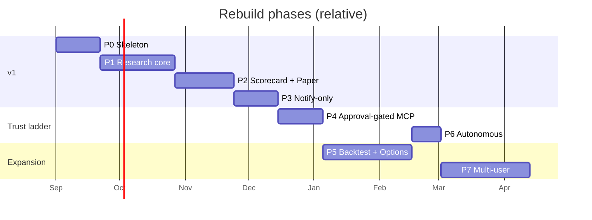

# 14 — Roadmap & Milestones

Eight phases. Each lists what to **port** from the original (its ideas are good; its foundations are not), what to **rewrite**, and an acceptance bar. Phases 0–3 are v1. Trust-ladder unlocks (doc 10) gate 3 → 4 → 6.

## Phase 0 — Skeleton (foundations the original never had)

**Build**: monorepo layout (doc 11); Docker Compose (postgres, redis, api, worker, web); Alembic with the initial schema (port the 24-table vocabulary, JSONB, real FKs, add `orders`, `order_events`, `risk_decisions`, `proposals`, `notifications`, `user_decisions`, `llm_calls`, `job_runs`, `lineage_edges`); auth (passkey/OAuth + session, API tokens); structlog + OTel; CI (ruff, mypy, pytest with per-test DB, coverage gate); `.env.example` **committed**; `BrokerAdapter` + `DataProvider` interfaces with the **Robinhood MCP adapter** for read paths and a `PaperBroker` stub; `sync_portfolio` job; Next.js shell with the 6-tab IA, auth, and a Portfolio page reading real positions.

**Port**: `models.py` vocabulary, `clean_ticker`, `SECTOR_ETF`, the repository's function *names* (rewritten with typed errors + logging), `market_clock` replaced by an exchange-calendar library.

**Accept**: real portfolio visible in the web app within 2 min of a change; zero credentials in env beyond the MCP connection; `alembic upgrade head` from empty; CI green; no unauthenticated route.

## Phase 1 — Research core

**Build**: `llm` layer (parse/ask/web_research/agent_loop, ModelRouter, cost ledger, prompt registry with golden tests); `monitor`; `analyst` + `judge` (different judge model) + `evals` taxonomy; `memory` with semantic triggers; `research_state` DB-only; `mandate`; `findings` with "No action needed"; `structural_risk` with fixed fallback; events bus; chat agent with the 16 tools on the shared loop; Today, Memory, Activity, Settings (profile + LLM budget) screens; SSE streaming; browser notifications.

**Port**: system prompt, `today_line`, gather→parse, container carry, GROUNDING DISCIPLINE, agent prompt (3-tier trust, explicit-mutation rule), judge prompt + gate + non-regression, evidence ledger, drift absorption, `_about_another_company`, per-span chart TTL + live-tip pinning (reimplemented on lightweight-charts).

**Accept**: analyze any ticker with cited sources and a judge score; a thesis re-judges on a real trigger; daily LLM spend visible per engine and capped; a calm book spends < $0.50/day.

## Phase 2 — Scorecard + paper Autopilot

**Build**: `shadow` ledger with anchors (port), `evaluation` v2 with CIs/drawdown/calibration and **tests**; the paper `PaperBroker` with the fill model; Autopilot (port twin: inception, critic, review windows, grace verdict, compare with fixed `edge_pct`, bandit, lessons) on top of `RiskGate` v1; discovery with multiple screens (judge-gated); missions with ticker validation; theme_scout + strategy_discovery deduped; Scorecard screen with the trust-ladder gauge; Autopilot as a view in Scorecard/Memory.

**Accept**: every recommendation has a matured/forming record with CIs; Autopilot runs a decision cycle end to end with a three-part trace; paper fills carry slippage; `edge_pct` is apples-to-apples; engine feedback block appears in analyst prompts.

## Phase 3 — Notify-only autonomous mode

**Build**: `Proposal` pipeline → Critic → RiskGate (full table, property-tested) → ModeRouter; Notifier (web push + Telegram, signed approve links, expiry, snooze, quiet hours, max/day); `user_decisions`; reconciliation of your real fills via MCP `get_equity_orders`; "followed vs not followed" counterfactual in Scorecard; kill switch (UI + Telegram + auto-triggers); daily execution report; Today shows pending proposals.

**Accept**: a proposal reaches your phone < 60 s after a decision; approve/decline/expire all recorded and scored; your real fill matched automatically; kill switch halts everything < 1 s; risk gate has 100% branch coverage.

**v1 ships here.**

## Phase 4 — Approval-gated execution (official MCP)

**Build**: `review_equity_order` → approval → `place_equity_order` → status polling → fills → broker-truth reconciliation; limit-only; GTC/session cancel policy; order lineage in Activity; execution unlock gate (doc 10 criteria) enforced in code and shown in Scorecard.

**Accept**: an approved proposal becomes a real limit order and its fill appears in the ledger with lineage; a declined review never places; an expired approval cancels; N weeks of notify-only history required before the mode is selectable.

## Phase 5 — Backtesting + options (expansion)

**Build**: bar store + point-in-time fundamentals; event-driven simulator reusing `PaperBroker` + `RiskGate`; rule backtests; decision replay over stored `agent_runs`; walk-forward; strategy experiments must pass a backtest before `active`. Options data via MCP, Greeks, `OptionsStrategist` (expression layer over equity theses), options risk-gate rules, options in paper/notify modes only.

**Accept**: a lookahead CI test passes; a strategy's backtest and its live paper result are shown side by side; a covered-call proposal on a HOLD thesis reaches notify-only with Greeks and assignment risk shown.

## Phase 6 — Autonomous-within-limits

**Build**: the autonomous route with post-trade notify + one-tap cancel, notify-first threshold, auto-demotion rules, market orders for urgent risk_reduction (opt-in); options execution one rung behind equities.

**Accept**: K weeks of approval-gated with ≥ X% unchanged approvals and zero gate breaches before the toggle appears; demotion fires on a synthetic breach in staging.

## Phase 7 — Multi-user / SaaS (expansion)

**Build**: tenancy on every table, encrypted broker tokens, per-tenant budgets/rate limits/job partitioning, Stripe billing, admin, legal review of execution features per jurisdiction.

**Accept**: two tenants cannot see each other's data under fuzzed requests; per-tenant LLM caps enforced; execution modes disabled by default for new tenants.

## Cross-phase tracks

- **Quality**: pytest per-test DB, call-count fixtures, golden prompts, schemathesis, vitest + Playwright smoke, replay harness for judge drift. Coverage gate 80% on `packages/brain`, 100% on `RiskGate`.
- **Observability**: job timeline (port `_brain_timeline`), cost dashboard, staleness heartbeat, error budget alerts.
- **Docs**: keep this folder current; every phase closes with an updated `improvements-tracker.md`.

## Milestone map

Dates are placeholders for sequencing only.
